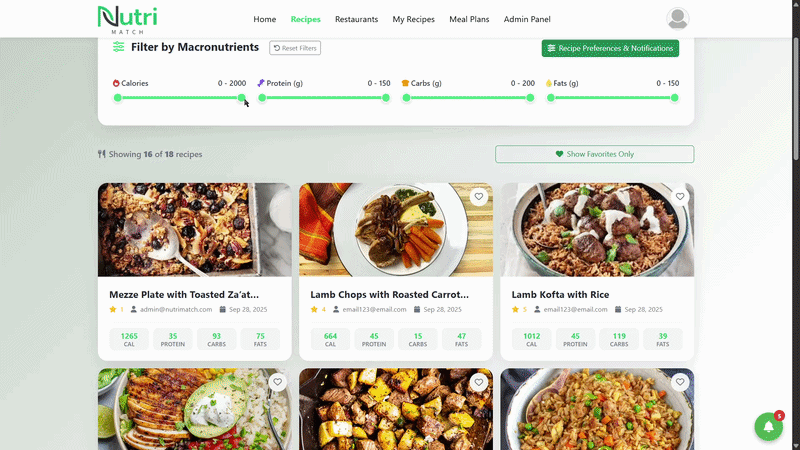
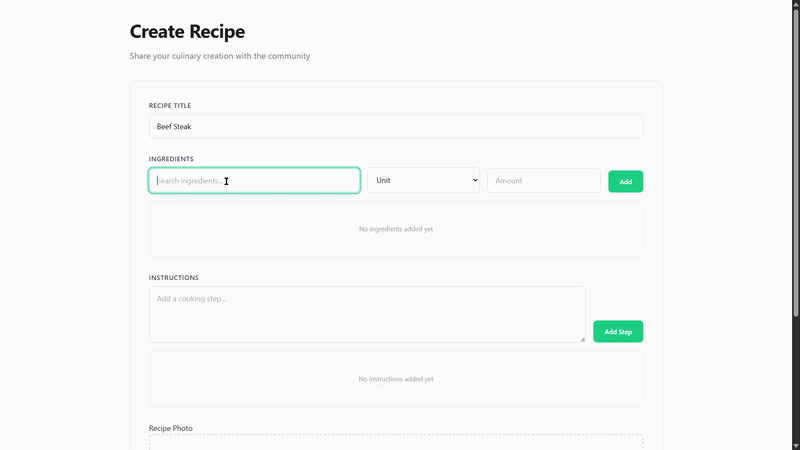
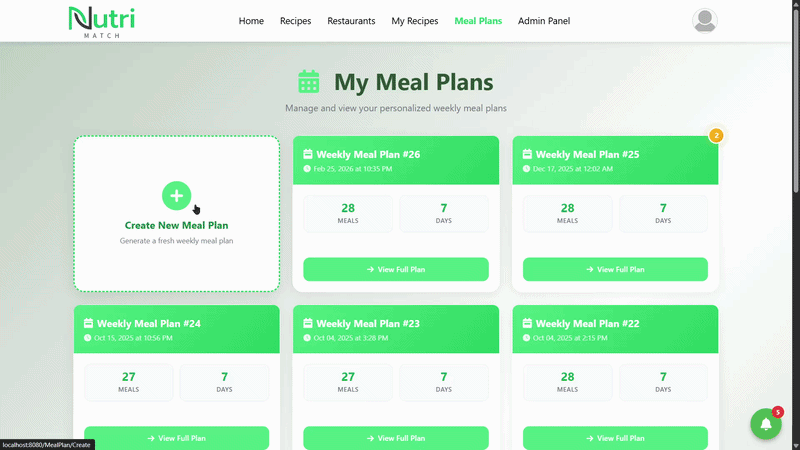
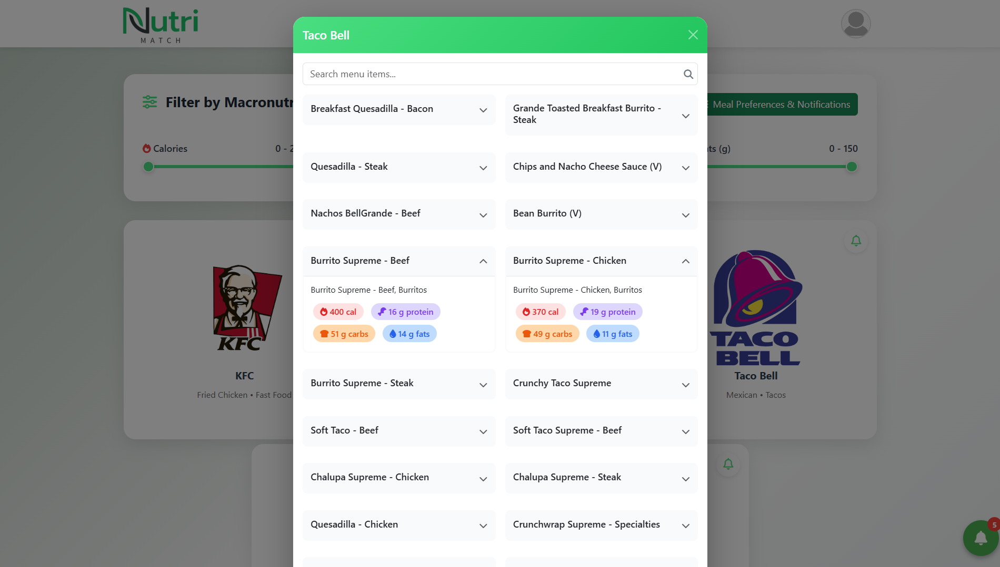

# NutriMatch

NutriMatch is a macronutrient-based meal discovery platform that lets users add, search and filter recipes/restaurant meals based on protein, fat, carb, and calorie targets.

### Purpose
There are countless recipe apps available, we struggled with one problem: not knowing what to eat to actually hit our macros. We didn’t just need more meal ideas — we needed meals that fit specific protein, carb, fat, and calorie targets. Constantly calculating macros and adjusting portions was frustrating and time-consuming.

 

## What Makes NutriMatch Different?
Unlike traditional recipe apps, NutriMatch is designed with macro tracking at its core:
 

### Filtering recipes by macros

 

### Creating a recipe
You just enter the ingredient and quantity, we calculate the macros

 

### Generating meal plans
You can generate meal plans based on your daily macronutrient needs

 

### Restaurant meals
You can also filter meals from restaurants

 

## Quick start
### 1. Clone the repository
git clone https://github.com/kiril232/nutrimatch

cd NutriMatch

### 2. Create the .env file
cp .env.example .env
- The app will run smoothly with this env file, however without keys, OAuth and email notifications simply won't work

### 3. Run the application
docker compose up --build

## Documentation
To see a detailed explanation of each phase of the development process click [here](https://develop.finki.ukim.mk/projects_finished/nutrimatch).

This project was developed as part of the "Internet Technologies" course at the FCSE in collaboration with [Milan Stojanoski](https://github.com/m1ki9). The technologies used are .NET MVC with PostgreSQL. Commits may not reflect individual contributions due to real-time collaborative coding, all work was performed through Visual Studio's Live Share feature and I am fully familiar with every part of the project.

